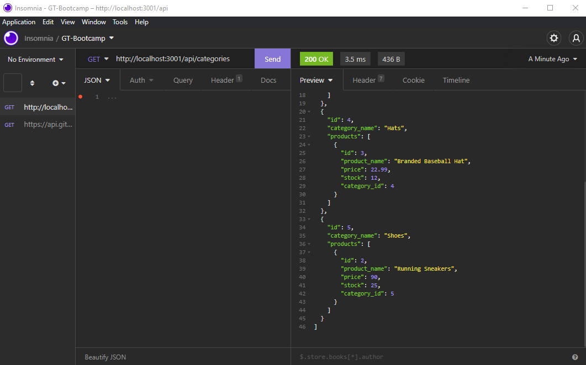

# E-Commerce Backend

## Table of Contents

1.[Description](#Description)  
2.[Link](#Link)  
3.[Installation](#Installation)  
4.[Usage](#Usage)  
5.[Contributing](#Contributing)  
6.[Tests](#Tests)  
7.[License](#License)  
8.[Credits](#Credits)  
9.[Questions](#Contacts)

## Link to repo

https://github.com/mkang987/Ecommerce-Back-End

## Video demo link

https://youtu.be/J8L4bw2IBes

## Description

The project is the back-end part for a website that will link mysql database technologies using sequelize to be able to update or retrieve information in the stored database.

## Licenses

  
[License Information](./generatedLicense.md)

## Installation

To install, you have to first run npm install. Login to mysql and run SOURCE ./db/schema.sql. Source the test data using npm run seed.

## Usage

Start the application by using the command npm run start. Use insomnia to go through eat correct API route to do what is needed. Which includes adding new data, deleting or editing data from the database.

## Contacts

Contact me via Email at mkang987@gmail.com
